# 1 - Unity et C#
Année 2023 / 2024 - Cours IUT Arles
Sur la base des documents du Laboratoire de Recherche en
Informatique (LRI), de l’Université du Québec à Chicoutimi (UQAC)
et de l’école nationale supérieur d’informatique pour l’industrie et
l’entreprise  
Loïc Durand


<hr>

# 2 - GAME ENGINE REAL TIME UNITY

<hr>

# 3 - Définition
•« Ensemble d’outils et de composants pouvant servir aux
calculs des géométries et de physiques utilisés pour la
création de jeux vidéo. L’ensemble offre un simulateur
en temps réel qui reproduit les caractéristiques d’un
monde.»

**Exemples :**  
• Doom & Quake Engines (IdSoftware)
• Unreal Engines (Epic Games)
• Source Engine (Valve)
• CryEngine (Crytek)
• Unity 3D
…

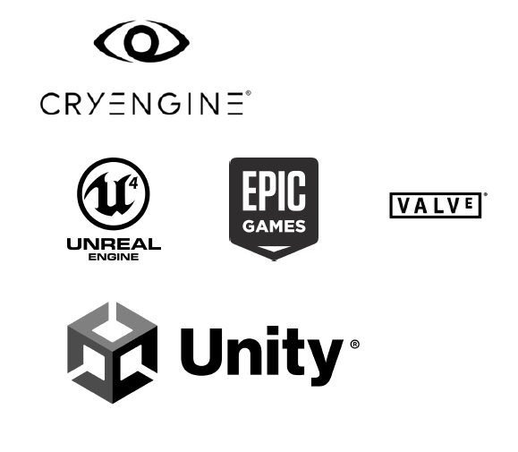 

<hr>

# 4 - Exemples de jeux

Cuphead (MHDR)
Tunic (ISOMETRICORP)
Oddworld Soulstorm (Oddworld Inhabitants)
SuperHot (SH Team)

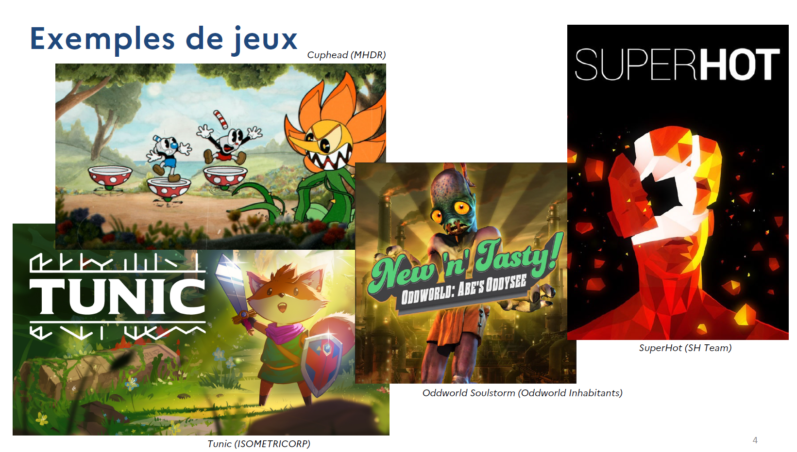 
<hr>

# 5 - Historique
•« En 2004, trois amis développeurs à Copenhague, visant
à créer le jeu "Gooball", constatent le manque d'outils
adéquats. Ils fondent Over the Edge Entertainment pour
développer un moteur de jeu, renommé Unity Software
Inc. en 2007. »

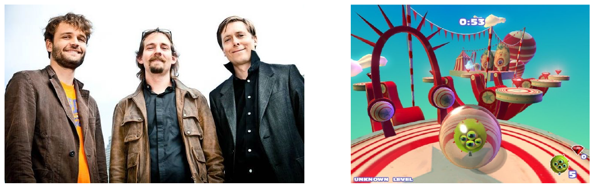 
<hr>

# 6

Download : https://unity3d.com/fr/get-unity/download
Account : https://id.unity.com/account/new
Unity Hub

•Logiciel permettant
la gestion des
projets et des
versions de Unity

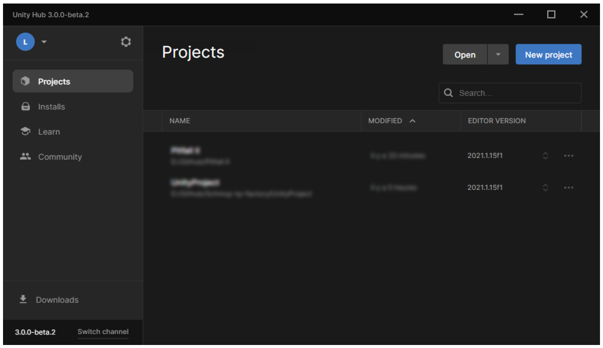 
<hr>

# 7 - Interface Overview

1. Hierarchy : Indique l’ensemble des
objets (GameObject) et leurs
relation.
2. Inspector : Les paramètres
(Component) de l’objet
sélectionné.
3. Scene : La vue d’édition (réglages
positions, orientations, ajout
d’objets …).
4. Game : Ce que la Caméra voit.
5. Project : Explorateur du projet
projet.
6. Console : Affiche les erreurs de
compilation  

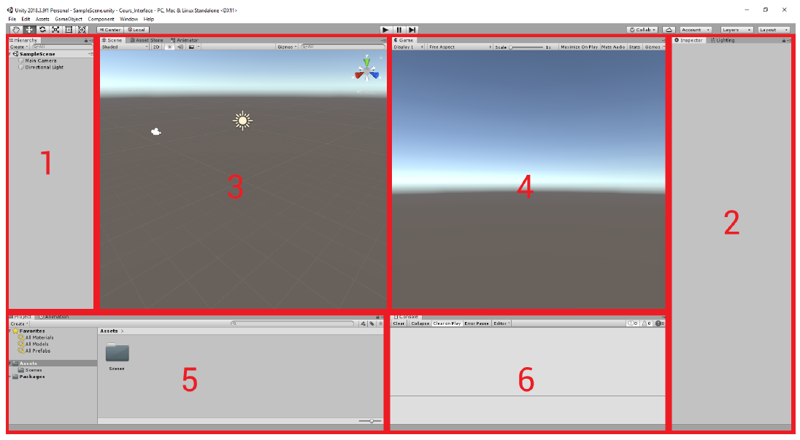 
<hr> 

# 8 - Nomenclature des assets

Tout élement est un asset (GameObject,
images, video, Scripts …)  
Forme : (Prefix_)AssetName(_Number)(_Suffix)  
Préfixe Nom Utilisation  
SK_ Skeletal SK_PoliceMan  
SM_ Static Mesh SM_Table  
S_ Sound S_Victory  
M_ Material M_Table  
T_ texture T_Table_A  
SP_ Sprite SP_Sonic  
A_ Animation A_PoliceMan  
Sufixe Nom Utilisation  
_A Albedo T_Table_A  
_N Normal Map T_Table_N  
_M Metallic T_Table_M  
_AO Ambient Occlusion  
T_Table_M  
_S Specular T_Table_S  
_R Roughness T_Table_R  
_H Height Map T_Table_H  

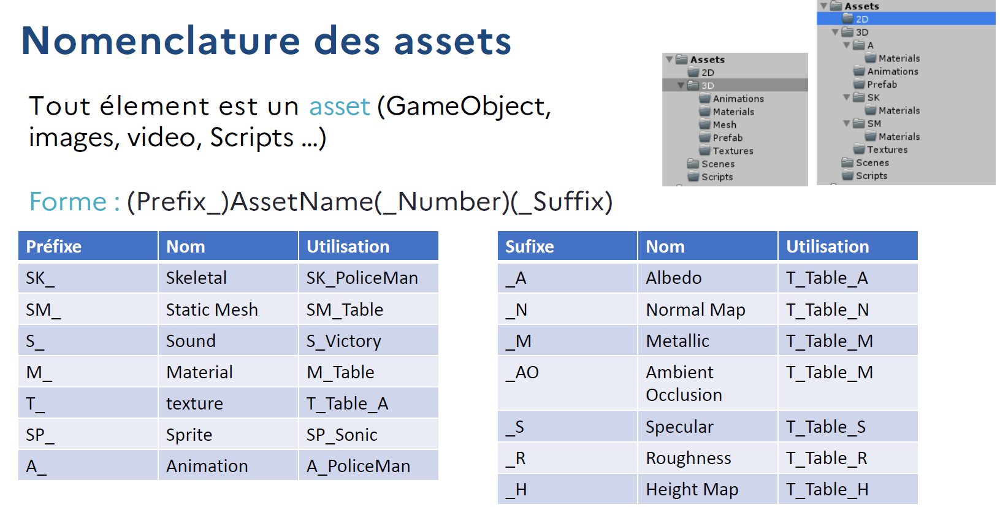 
<hr>

# 9 - GameObject & Components

Tout objet est un GameObject contenant des
propriétés (Components)  
• Transform stockant la position, l’orientation et l’échelle  
• Mesh Filter & Renderer proposant le maillage  
ainsi que le rendu à la carte graphique  
• Collider communément appeler « hitbox »,  
permettant la détection des collisions physiques  
• Rigidbody applique la physique (Forces, masse, gravité …)  
• Et bien d’autres Animator, ect …

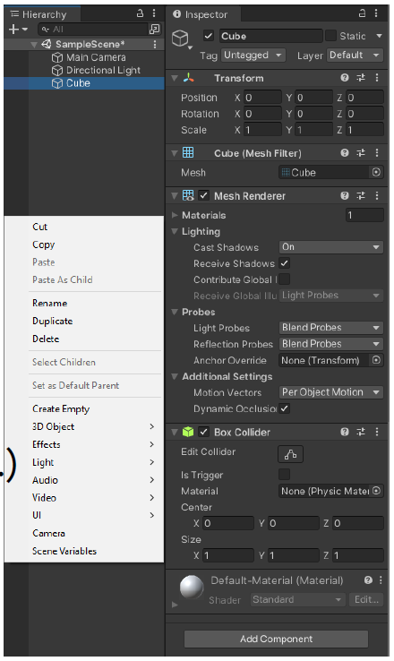 
<hr>

# 10 - La physique

Un Collider définit la forme, le volume d'un
objet pour permettre la détection des
collisions physiques. A l’inverse, un Collider
où sa propriété isTrigger est coché, ne se
comportera pas comme un objet solide et
permettra à d’autres objets de passer à
travers lui.
Un Rigidbody permet à un
objet de réagir à des forces
ou des torsions de manière
« réaliste »

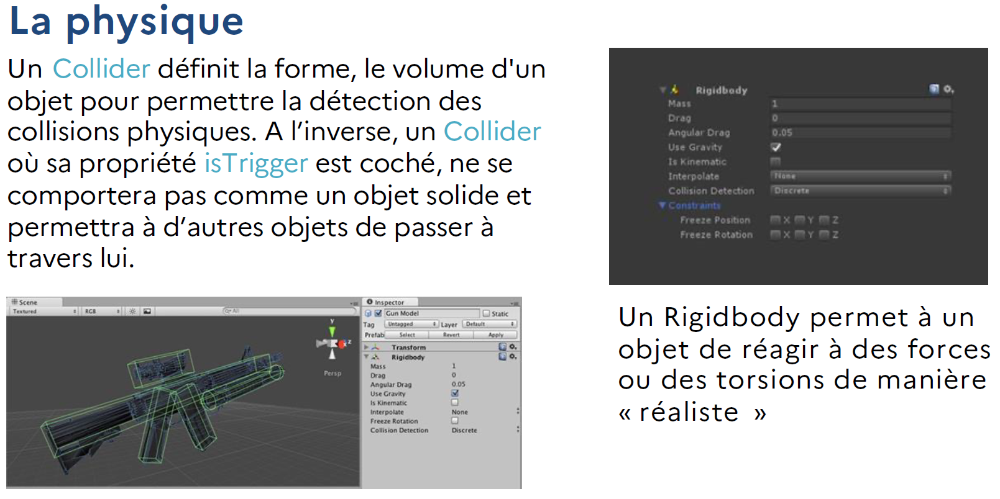 
<hr>

# 11 - Materials & Textures

Une Texture est une image représentant une surface
offrant la possibilité de simuler l’apparence de celle-ci
lorsqu’elle est plaquée sur un objet 3D  
• Albedo (diffuse) Couleur de l’objet  
• Normal Map : Détail de surface (Effet de profondeur)  
• Metallic : Détail de réflexion  
• Ambient Occlusion : Permet d’assombrir les zones  
naturellement difficiles d’accès pour la lumière  

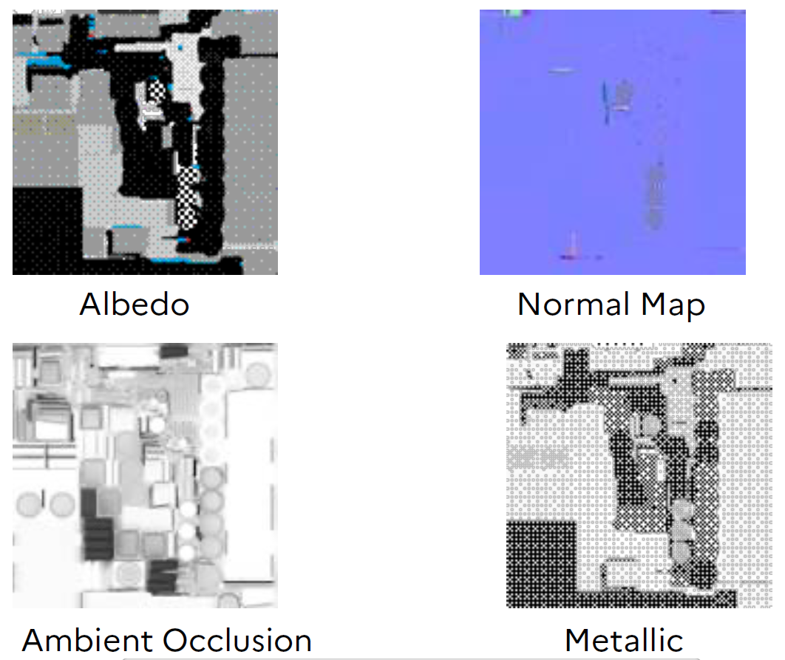 
<hr>

# 12

- Albedo 
- Normal Map
- Ambient Occlusion 
- Metallic
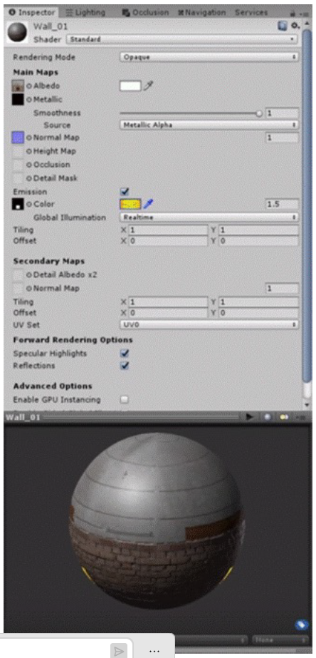 
<hr>

# 13 - Materials & Textures

Un Material est un asset
prenant en paramètre une
ou plusieurs textures pour
définir les paramètres de
surface d’un objet.
Valeur importante :  
• Rendering mode : opaque ou
transparent selon si vous voulez
de la transparence. Le mode
CutOut pourrait être utile si vous
avez besoin d’une partie
transparente sur une texture
opaque (exemple des autocollant
sur une vitre).

 
<hr>

# 14 - Materials & Textures

On voit que les matériaux
métalliques auront en général une
valeur de metallic proche de 1.
Et une smoothness variable selon le
rendu souhaité et la matière, un
argent aura une valeur plus élevée
qu’un acier. Une métal poli aura une
valeur plus élevée que le même
métal brut.

<hr>

# 15 - La lumière et les réflexions

## Différents type de lumière :
• Directional Light : lumière de base de chaque scène, elle simule le
soleil. N’est utile que si l’on veut une lumière “réelle”. Une ambiance
de lumières artificielles n’a pas forcément besoin de ce type de
lumière. Seule son orientation compte, sa position n’a aucune
importance. Elle applique en tout point accessible de l’extérieur une
lumière selon son orientation et son intensité.  
• Point light : lumière de type ampoule, lumière plus artificielle. Elle
s’applique dans tous les sens à partir de son point de pivot selon son
intensité et sa portée (range).  
• Spot light : lumière de type spot, donc lumière artificielle. Elle
s’applique selon un cône avec une intensité, une portée et un angle.  
• Area light : pas nécessaire pour vos besoins, sert à illuminer selon une
forme rectangulaire. Très gourmand en ressource pour un résultat
proche du spot.


<hr>

# 16 - La lumière et les réflexions

## Les réflexions :
Certains objets ont plus ou moins de capacité à réfléchir la lumière. En
plus de la lumière directe il faut qu’unity puisse générer les réflexion
liées aux autres objets et à l’environnement. Pour cela il faut installer
une réflexion probe (dans le groupe light des gameobject unity).
Les réflexions qui sont bakées le sont en même temps que les light.
Donc encore une fois ne pas oublier de faire son bake surtout si l’on
déplace un objet statique, son ombre ne bouge pas ni les réflexions
induites. Comme pour les lights, les réflexions dynamiques sont très
gourmandes en ressources donc à utiliser le moins possible.


<hr>

# 17 - Les raccourcis

Les plus utilisés :  
• Ctrl+D : Dupliquer  
• F après avoir sélectionné
un gameobject dans la
hiérarchie : focus du point
de vue de la scène sur
l’objet.  
• Alt + bouton gauche de la
souris : Rotation de la vue
en orbital

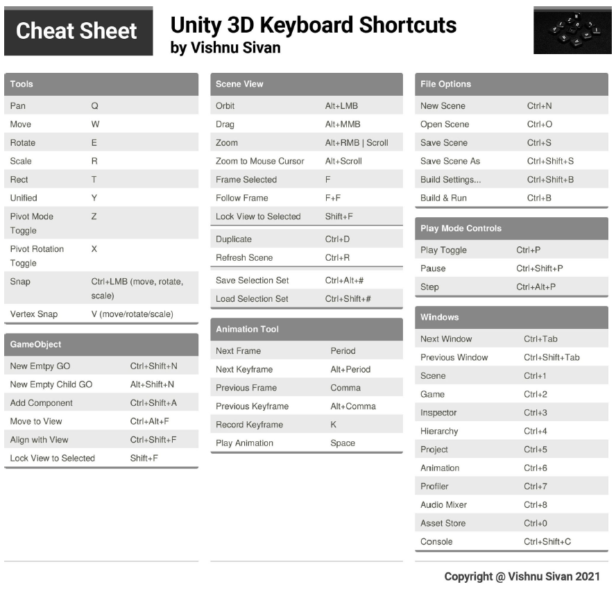 
<hr>

# 18 - Importation d’assets

• Soit par le menu Assets / import new asset et on sélectionne le fichier
souhaité dans la fenêtre qui vient de s’ouvrir  
• Dans la fenêtre projet, clic droit avec la souris et import new asset
(c’est un raccourci vers la commande précédente.  
• Drag and Drop du fichier directement dans la fenêtre projet
Un assets est un fichier utilisable par unity, cela concerne donc les
modèle 3D, les textures, les materials Unity 3D, les sons, les scripts et
les préfabs par exemple.


<hr>

# 19 - AssetStore d’Unity 3D

Tout se passe sur le site d’unity.  
C’est un store classique, on se connecte et on trouve l’asset qui nous
intéresse.  
Une fois acheté et téléchargé il s’installe pour le moteur unity et
devient disponible dans le package manager. Il devient disponible pour
tous les projets !  
Dans de rares cas cela peut-être un package indépendant à installer
manuellement. Dans ce cas on utilise la commande situé dans le menu
Assets / Import Package / Custom package et on sélectionne le package
manuellement.


<hr>

# 20 - Créer une scène

Pour ajouter une gameobject à une scène :  
• C’est un modèle 3D disponible dans le projet : drag and drop le
modèle dans la fenêtre de scène ou dans la fenêtre hiérarchie.  
• C’est un gameobject disponible dans unity : dans la hiérarchie
appuyer sur le “+” ou clic droit et on choisit le gameobject dans la
liste
Liste des gameobjects disponible dans unity qui sont importants :  
• directionnal light / point light / spot light  
• reflexion probe  
• canvas (pour les UI)  
• camera  
• formes de base : cube / sphere / cylindre / capsule


<hr>

# 21 - Créer une UI

Pour ajouter une UI à
votre jeu, ajouter un
canva dans la hierarchy.
A partir de là, vous
pouvez ajouter des images
et du texte.
Vous pouvez bien sûr
manipuler le texte via C#.

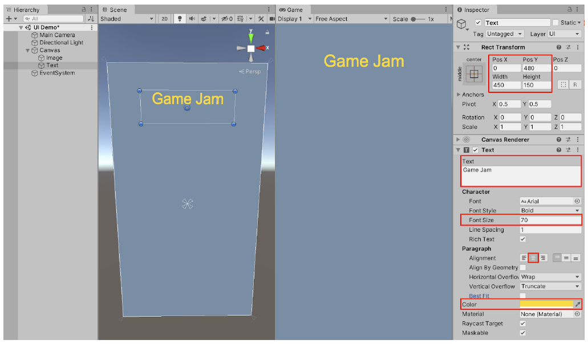 
<hr>

# 22 - Programmation sous Unity
## C# de base


<hr>

# 23 - Le scripting C#

Dans Le framework Unity, tout nouveau
script est une Classe (Ici PlayerController
qui hérite de MonoBehhaviour).
Les Using, permettent d’importer des
collections de classes (Ici des
bibliothèques de classes .Net et celle de
Unity).  
https://msdn.microsoft.com/fr-fr/library/system.collections(v=vs.110).aspx  
https://msdn.microsoft.com/fr-fr/library/system.collections.generic(v=vs.110).aspx  
En C#, il faut obligatoirement déclarer la
classe. Le nom de cette dernière doit être
le même que le nom du script dans
l'interface de Unity sinon il y aura une
erreur.
MonoBehavior est la librairie de Unity qui
contient les classe GameObject , Transform,
Update(), Start() etc.
Les notions de base de la programmation fonctionne également, tel que
l’héritage, l’encapsulation, le polymorphisme, l’abstraction …

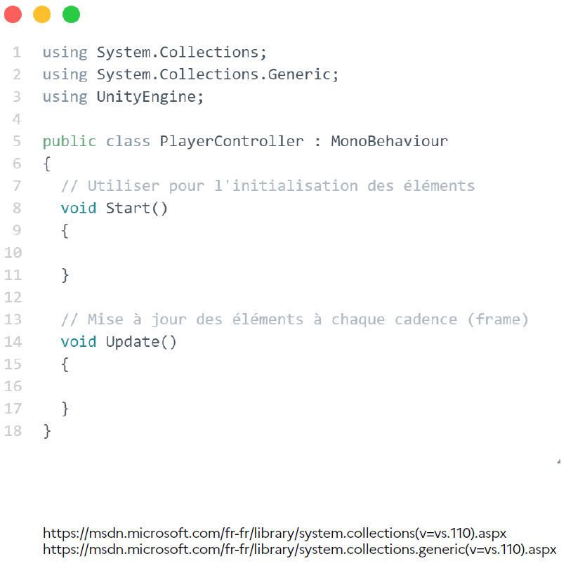 

<hr>

# 24 - C# : Les variables

En C# :  
• les variables sont privées par
défaut et non manipulable via
l’inspector.  
• Les variables Public et Sérialisés
sont modifiables via l’inspector.  
• Il existe des types spéciaux
(Rigidbody, GameObject,
Collider, ect…)  
• Les nombres à virgules (float)
doivent être suivis de la lettre
« f ».  
• Les variables sont en camelCase 
• Les privés commencent par un _  
• Les noms doivent être explicites  

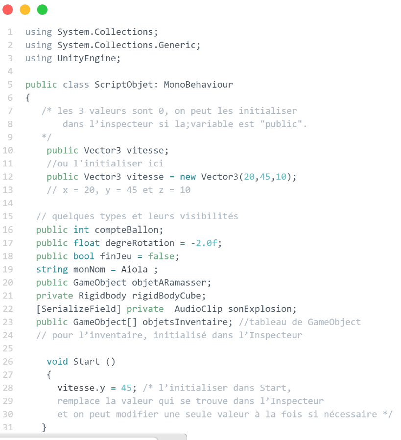 
<hr>

# 25 - C# : Les fonctions / Méthodes

En C# :  
• Les fonctions et Méthodes s’écrivent en
PascalCase.  
• Les fonctions et Méthodes sont privées 
par défaut et non manipulable via  
l’inspector.
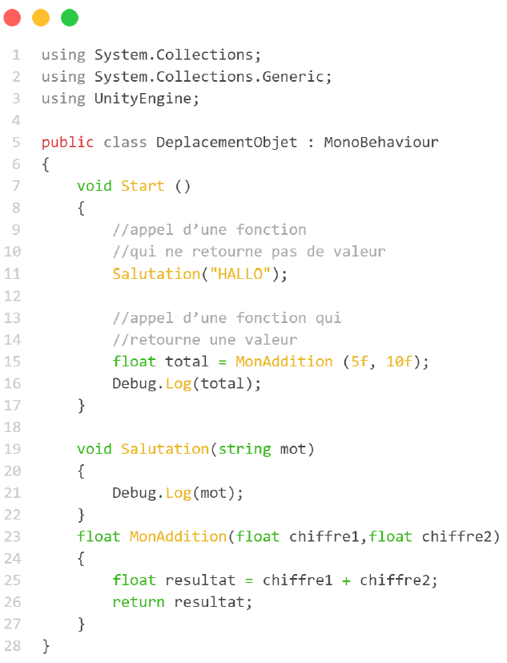 
<hr>

# 26 - C# : Méthodes spéciales

Sous Unity, il existe des méthodes un peu particulière :  
• Awake() : Méthode appelé au lacement avant Start()  
• Start() : Méthode appelé au lacement  
• Update() : Méthode appelé à chaque frame (Boucle de jeu)  
• FixedUpdate() : Méthode appelé 50 fois par secondes  
• OnColliderEnter() : Méthode appelé quand on rentre en collision  
• OnColliderExit() : Méthode appelé lorsque l’on sort d’une collision  
• OnColliderStay() : Méthode appelé lorsque l’on est en collision  
• OnTriggerEnter() : Même chose que précédemment mais que 
lorsque le collider est noté en isTrigger  
• OnTriggerExit()  
• OnTriggerStay()  

<hr>

# 27 - C# : Le composant Transform

Via script, vous pouvez accéder au Transform d’un GameObject  
transform.position -> la position en x,y,z de l'objet qui possède le script  
transform.rotation -> la rotation en x,y,z de l'objet qui possède le script  
transform.scale -> l'agrandissement de l'objet qui possède le script  
ATTENTION :  
• position et scale sont de type Vector3  
• rotation est de type Quaternion (représente les angles mais pas en degré, plus optimal
pour 3D)  
## REMARQUE:  
En C#, il n’est pas possible de modifier directement les valeurs .x , .y et .z d'une
propriété d’une classe interne de Unity de type Vector3 (ex: position, rotation,
velocity, etc.).

<hr>

# 28 - C# : Le composant Transform

Via script, vous pouvez accéder au Transform d’un GameObject  
transform.position -> la position en x,y,z de l'objet qui possède le script  
transform.rotation -> la rotation en x,y,z de l'objet qui possède le script  
transform.scale -> l'agrandissement de l'objet qui possède le script 

**ATTENTION :**   
• position et scale sont de type Vector3  
• rotation est de type Quaternion (représente les angles mais pas en degré, plus optimal
pour 3D)  

**REMARQUE:**  
En C#, il n’est pas possible de modifier directement les valeurs .x , .y et .z d'une
propriété d’une classe interne de Unity de type Vector3 (ex: position, rotation,
velocity, etc.).

<hr>

# 29
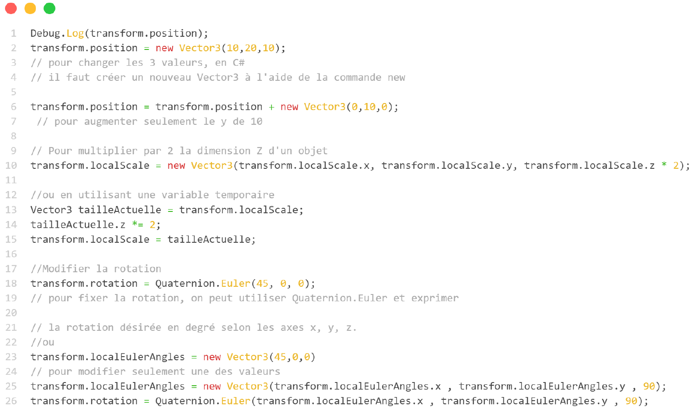 
<hr>

# 30
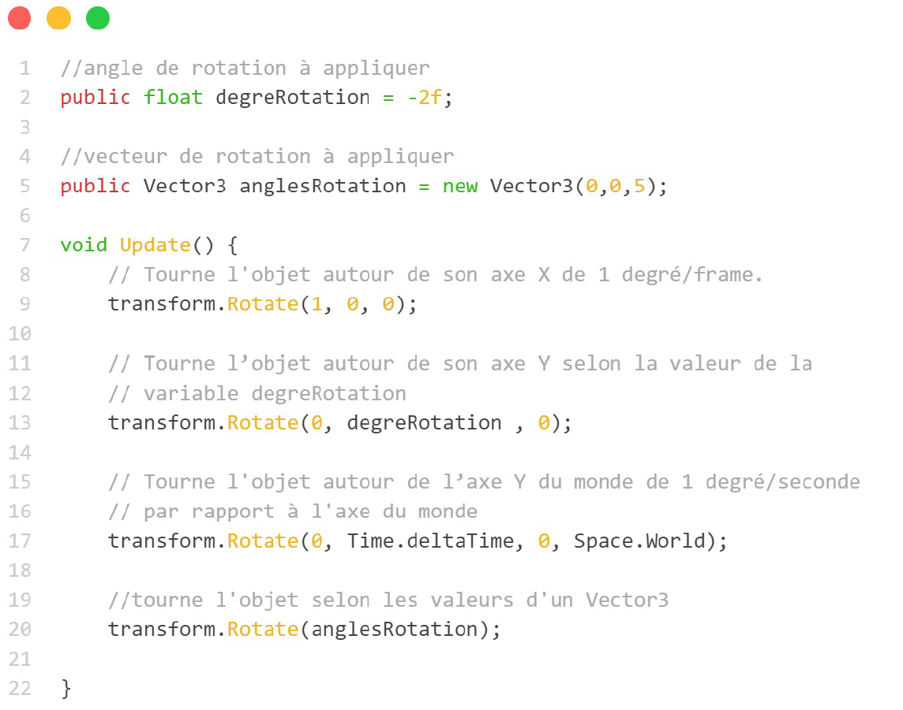 
<hr>

# 31 - C# : Les composants

Certains composants sont accessible en utilisant 
```C#
GetComponent<Type>()
```

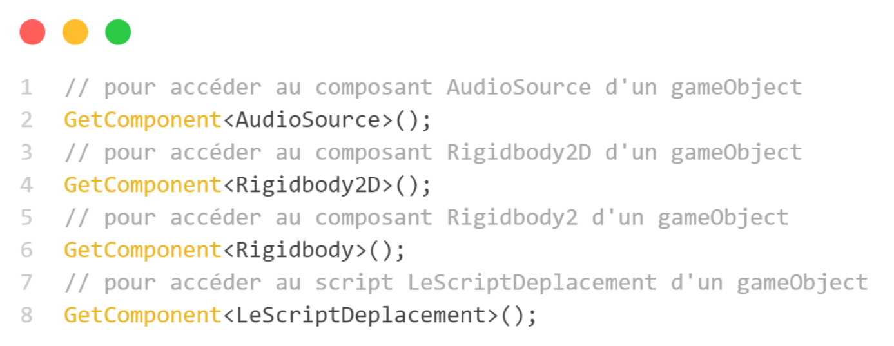 
<hr>

# 32
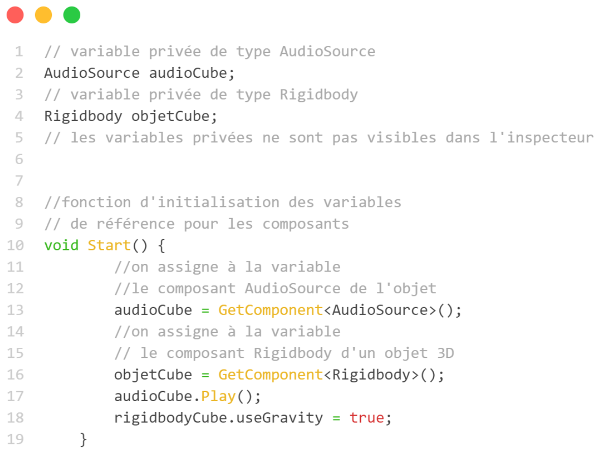 
<hr>

# 33 - C# : Détection des touches
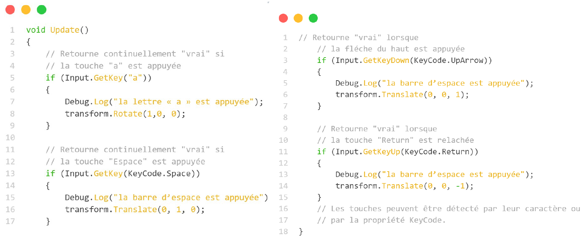 

<hr>

# 34 - C# : Communication entre deux Objets

Il faut dans le script:  
• déclarer une variable public de
type GameObject,  
• assigner l’objet à cette variable
dans l’inspecteur  
• utiliser GetComponent pour
accéder aux propriétés ou aux
variables du script de cet
objet.
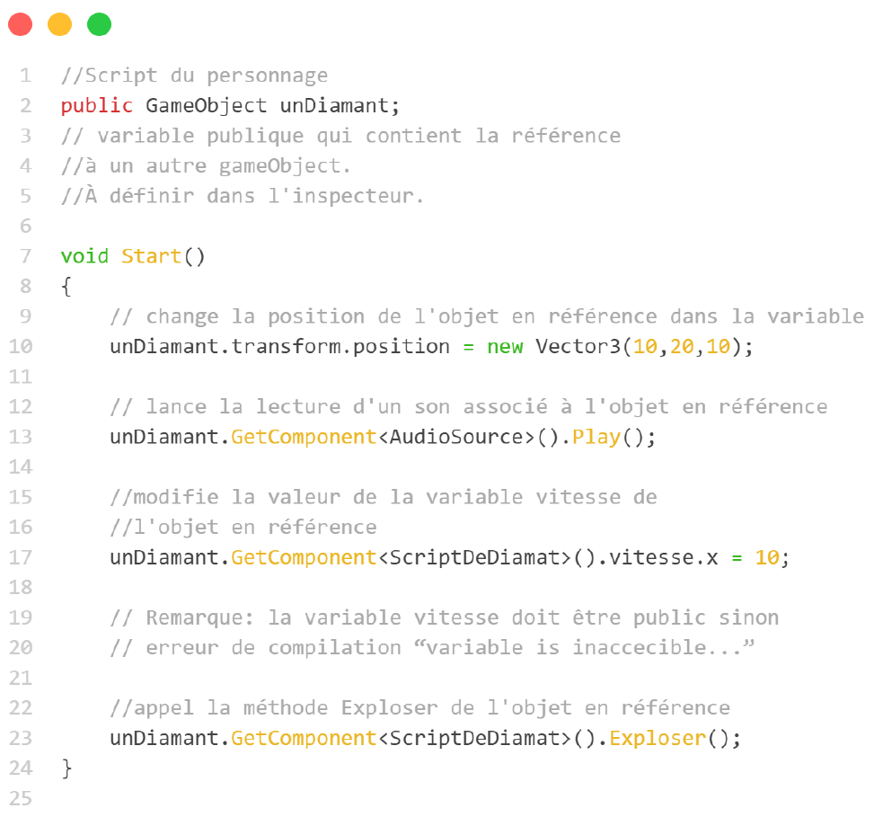 
<hr>

# 35 - C# : Communication entre deux Objets

Une autre méthode existe, si nous avons besoin d’accéder seulement au script d’un objet  
alors on peut mémoriser la référence du script, pour cela il faut :  
• déclarer une variable public de type NomScript, (Nom de la classe du script)  
• assigner l’objet à cette variable dans l’inspecteur  
• Accéder aux propriétés du script de cet objet.

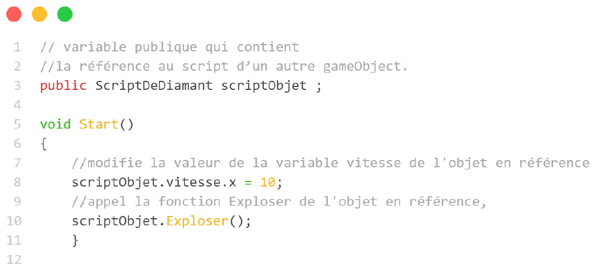 
<hr>

# 36 - Programmation sous Unity C# avancé
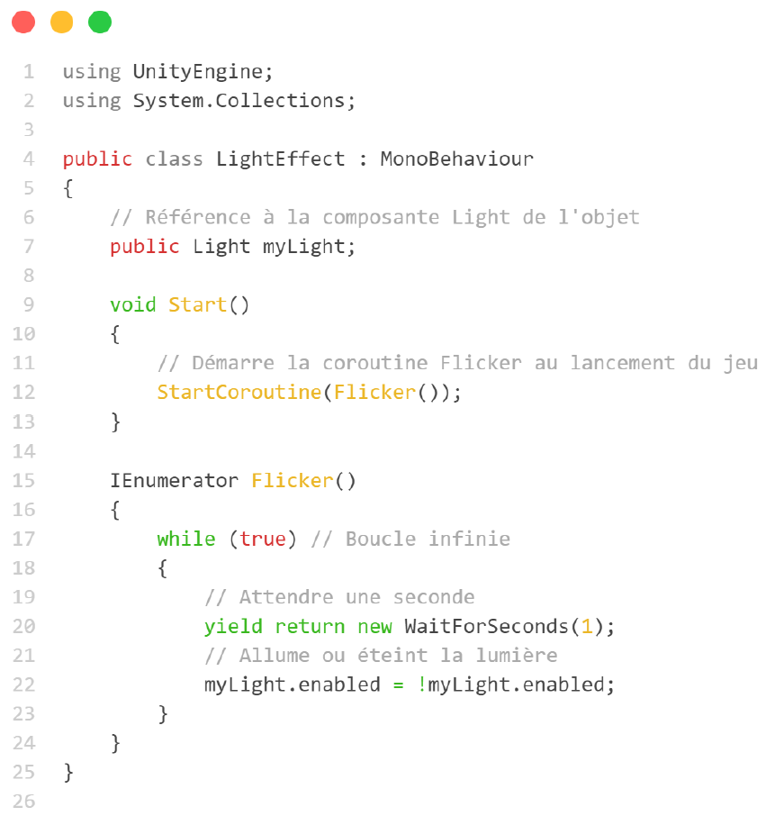 

<hr>

# 37 - C# : Les Coroutines

Une coroutine est une fonction qui a la capacité de suspendre son
exécution (à l'aide de l'instruction yield) et de reprendre là où elle s'est
arrêtée à la frame suivante ou après un certain délai.  
Contrairement aux fonctions normales qui s'exécutent du début à la fin
sans interruption, une coroutine peut s'étaler sur plusieurs frames.

<hr>

# 38 - C# : Les Coroutines

**Intérêt :**  
• Gestion du temps et des délais : Permet de gérer facilement les délais et
les exécutions sur la durée, comme les animations ou les comportements
qui évoluent dans le temps.    
• Simplification du code : Rend le code plus lisible et plus facile à
comprendre, en évitant par exemple les boucles de mise à jour
compliquées dans Update().  
• Performance : Peut améliorer les performances en répartissant une tâche
lourde sur plusieurs frames, évitant ainsi de bloquer le frame en cours.

<hr>

# 39

<hr>

# 40 - C# : Les RayCast

Un Raycast est un outil très utile qui vous permet de détecter si une ligne
invisible, ou "rayon", touche quelque chose dans votre scène de jeu.
Imaginez que vous pointiez un laser depuis un point dans l'espace : le
Raycast suit le chemin de ce laser et vous dit s'il heurte un objet.
Voici quelques points clés à comprendre :   
**Origine et Direction :** Un Raycast a besoin d'une origine (où il commence) et d'une direction (vers où
il pointe). Dans Unity, ces informations sont souvent fournies par la position et l'orientation d'un
objet de jeu.  
Détection de Collision : Le Raycast vérifie si le rayon croise un "collider" (un composant qui définit la
forme physique d'un objet pour la détection de collisions) dans la scène. Si le rayon touche un
collider, Unity peut vous donner des informations sur ce point de contact.

<hr>

# 41 - C# : Les RayCast

Utilisations Courantes :  
Détection d'obstacles : Vérifier si le chemin d'un personnage ou d'un
projectile est libre.  
Interaction à distance : Permettre aux joueurs d'interagir avec des objets
sans les toucher directement (comme pointer et cliquer).  
Vision AI : Déterminer si un personnage non-joueur peut "voir" le joueur.
Personnalisation : Vous pouvez personnaliser la longueur du rayon, ignorer
certains objets ou calques, et bien plus encore, ce qui rend le Raycast très
flexible et puissant pour divers besoins dans votre jeu.  
Retour visuel dans l'éditeur : Avec Debug.DrawRay, vous pouvez visualiser le
rayon dans l'éditeur Unity, ce qui est très utile pour le débogage.

<hr>

# 42
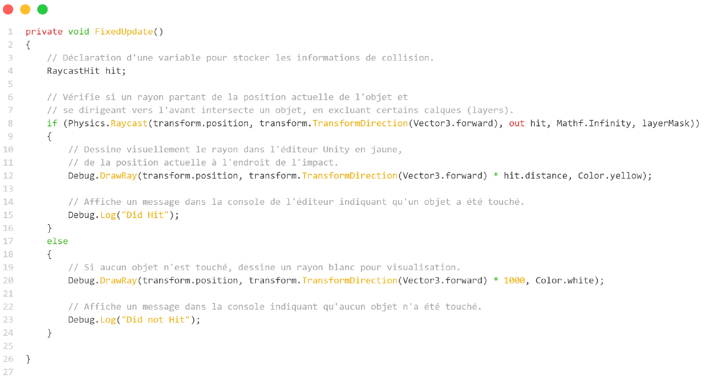 
<hr>

# 43 - C# : Les événements | Events

• La programmation pilotée par les événements dans Unity est guidée par
des événements tels que des entrées de capteur, des actions de
l'utilisateur, ou des messages d'autres programmes. Ces événements
déterminent le flux de contrôle du programme.  
• Exemple concret : L'utilisation de Input.GetKeyDown() pour gérer les
entrées. Un événement est déclenché lorsqu'une touche spécifique est
pressée.  
• Caractéristiques d'un événement : Peut avoir un ou plusieurs arguments,
similaire à une fonction. Par exemple, OnCollisionEnter reçoit un objet
collision contenant des détails sur la collision.

<hr>

# 44 - C# : Les événements | Events

Fonctionnement :  
• Définition d'un événement.  
• Spécification de ce qui active l'événement (ex. : Invoke()).  
• Définition des éléments qui vont écouter et réagir à l'événement.
Intérêt :  
• Rend le code plus modulable, en séparant les déclencheurs (ex. : UI,
détection de touches, collisions) des actions déclenchées.  
• Facilite la communication entre objets dans la programmation orientée
objet (POO).  
• Exemple POO : Un piège et une poignée de porte déclenchant la même
action (ouvrir une porte) peuvent partager la même fonction d'ouverture
grâce aux événements, simplifiant le code et évitant les répétitions.

<hr>

# 45
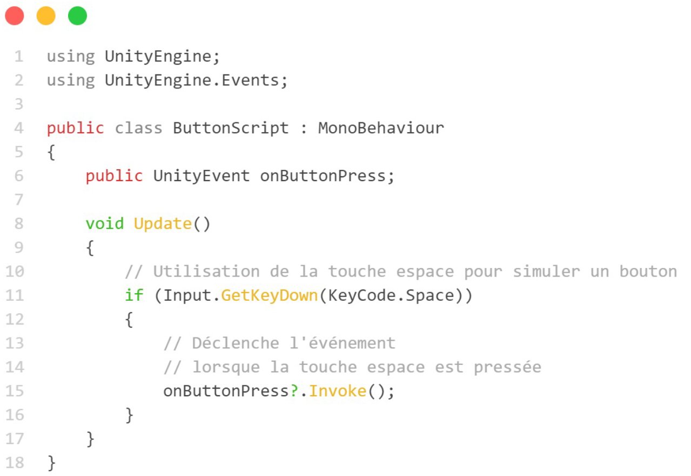 
<hr>

# 46
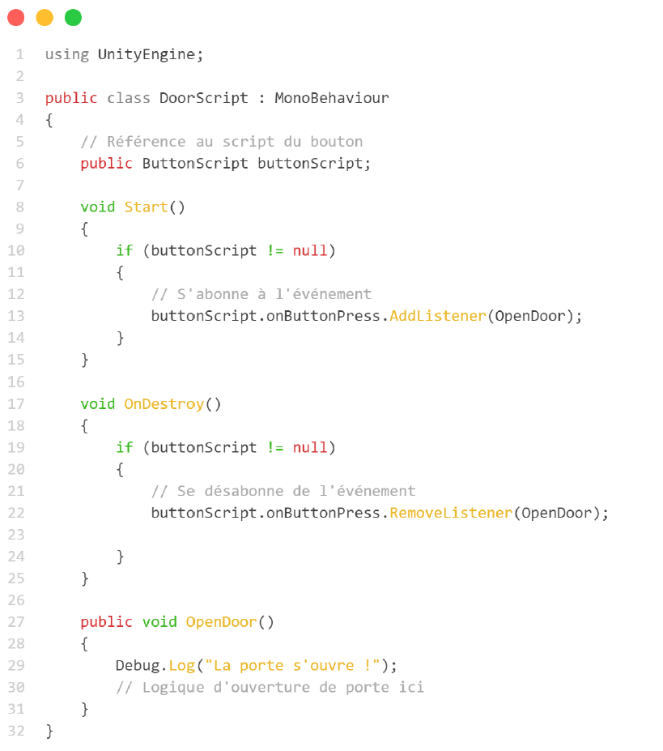 
<hr>

# 47 - Trois solutions pour utiliser les events :
•Les Events C# (Action)  
• Pas intégrés du tout dans Unity (uniquement en code)  
• Pas de réglages via l’interface d’Unity  
• N’ont pas besoin d’informations ni sur l’origine de l’event ni sur ses cibles  
• Plus optimisé que les events Unity  
• Ecriture simplifiée par rapport aux Delegates  
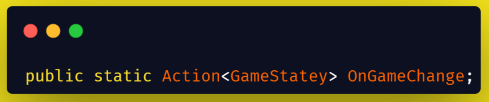 

<hr>

# 48 - C# : Les événements | Events
•Les Event Delagates  
• Pas intégrés du tout dans Unity (uniquement en code)  
• Pas de réglages via l’interface d’Unity  
• N’ont pas besoin d’informations ni sur l’origine de l’event ni sur ses cibles  
• Plus optimisé que les events Unity et Actions / Plus lourdes à écrire que les
Actions  
• Besoin d’un canva (conteneur de fonction), de sa signature ainsi que son type
de retour  
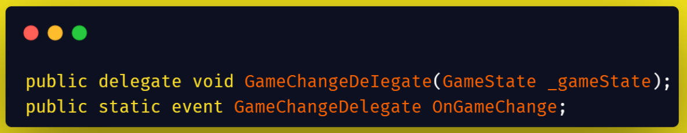 
<hr>

# 49 - C# : Les événements | Events
Les Scriptables Objects sont des structures de données utilisés
pour encapsuler / partager de grandes quantités de données
dans un asset réel indépendamment du Commun  
Pattern (Variable Statiques/Globales + Class + Methods +
Reference)  
C# : Les Scriptable Objects  
Les avantages  
Facile à lire et éditer (référence)  
Faciliter le Partage  
Centralisation et organisation des données abstraites  
Limite les incohérences  

<hr>

# 50
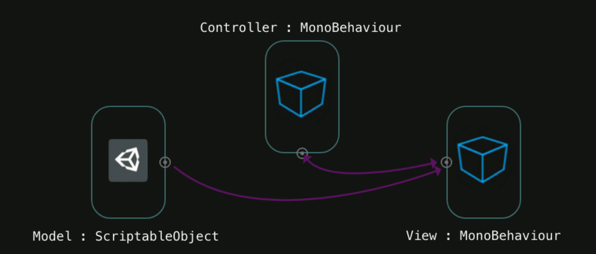 
<hr>

# 51
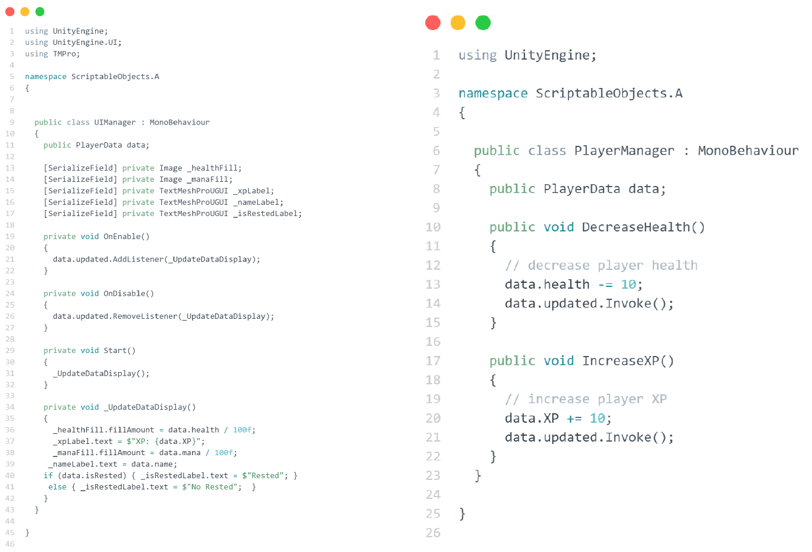 

<hr>

# 52
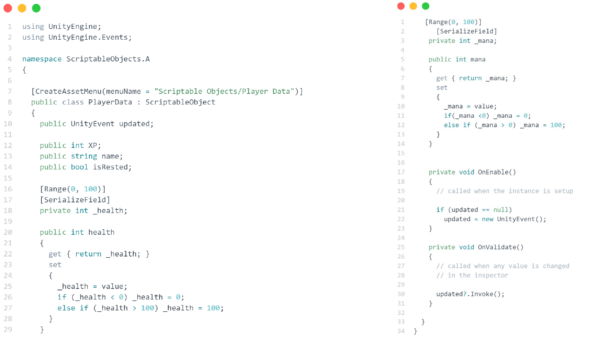 

<hr>

# 53 - C# : Design Pattern

Un design pattern, ou motif de conception, est une solution éprouvée à un
problème courant dans la conception de logiciels. Plutôt qu'une solution
spécifique à un problème, c'est un guide ou un modèle à suivre, permettant aux
développeurs de résoudre des problèmes de conception de manière efficace et
réutilisable. Ces motifs ne sont pas des designs finis qu’on peut transformer
directement en code; ils sont plutôt des descriptions ou des modèles pour
résoudre un problème qui peuvent être utilisés dans de nombreuses situations
différentes.  
Quelques Design :    

• Observer  
• Final State Machine  
• Object Pooling  
• Command  

# 54 - Build : Sortir son Exécutable

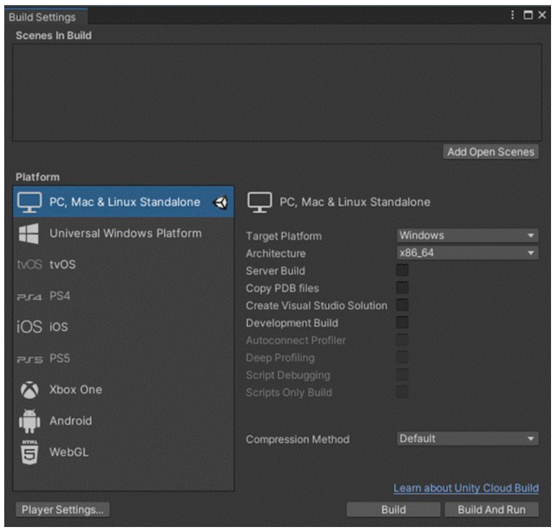  
Pour créer un éxécutable, il suffit
de vous rendre dans les Builds
Settings, d’ajouter vos scènes
puis de cliquer sur Builds

