# 1 
## IUT Arles Unity
  

Loïc Durand  

# 2  

### Unity 3D
Unity 3D est ce que l’on appelle un Moteur de jeu vidéo (Game Engine).
Un moteur de jeu est un ensemble d’outil pour faire un ou plusieurs jeux, ils permettent entre autres :  
- Editer des scènes
- Rendu 3D
- Moteur Physique
- Rendu audio
- IA
- Scriptings
- Animation
- Edition personnelle gratuite / professionnelle payante
- Itération rapide
- Multiplateforme
- Asset Store 

**Exemples**  
- Cuphead (MHDR)
- SuperHot (SH Team)
- Oddworld Soulstorm (Oddworld Inhabitants)  

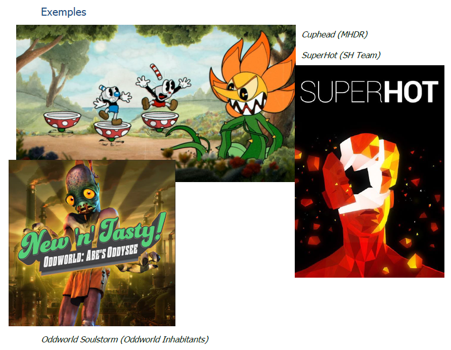

**Unity Hub**  

Unity hub est une application permettant une meilleure gestion de vos projets ainsi que des
versions de Unity utilisées.  

Pour l’installer, il suffit de se rendre sur le site officiel de Unity et de créer un compte avec une
licence personnel.  

Download : https://unity3d.com/fr/get-unity/download  
Account : https://id.unity.com/account/new  

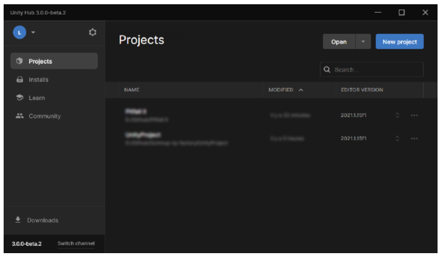

# 3 

**Interface Overview**  

L’interface se présente comme ceci :  
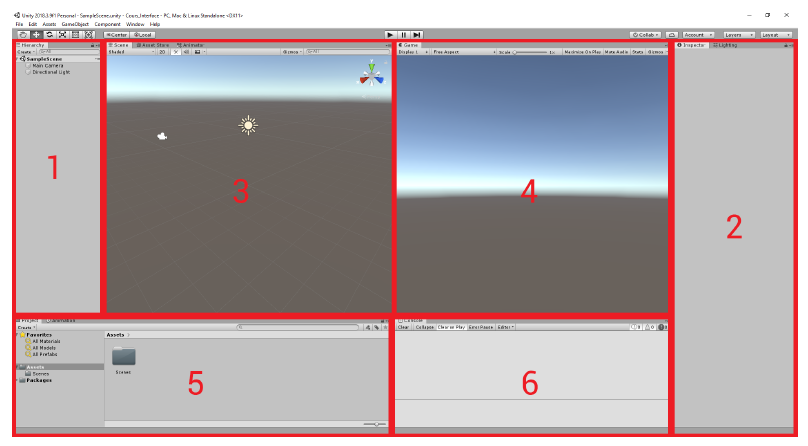
1. Hierarchy : C’est la vue qui indique l’ensemble des objets (GameObject) et leurs relation.
2. Inspector : Ce sont les paramètres (Component) de l’objet (GameObject) sélectionné.
3. Scene : C’est la vue d’édition d’Unity (réglages positions, orientations, ajout d’objets …).
4. Game : Exécution de l’application, c’est la vue de la Camera.
5. Project : C’est l’explorateur de votre projet.
6. Console : La console affiche les erreurs relatives à votre projet. (Erreur de compilation)  

Les interactions dans l’éditeur graphique peuvent se faire à partir des boutons suivants :  
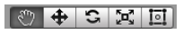  
Dans l’ordre : Déplacement, Translation, Rotation, Echelle  

L’exécution de l’application se fait à partir des boutons suivants :  
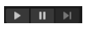  

# 4  

**Astuce** :  
 En tout temps, vous pouvez modifier la disposition des “Layouts” en cliquant sur Window > Layouts. Ou les déplacer à la façon d’onglets.  

**Astuce** :  
 Vous pouvez également générer des primitives à l’écran (Cube, Sphere …), dans GameObject > 3D Object.

**GameObjects & Components**  
Tous les objets utilisés dans une application sont appelés des GameObjects.
Ils contiennent des propriétés appelées Components.  

**Astuce** :  
 Un objet vide contiendra uniquement un composant de type Transform permettant de gérer ses propriétés spatiales (position, orientation, échelle)  

Un solide possèdera en plus un Mesh Filter (sa géométrie), Mesh Renderer (rendu visuel), Collider (gestion des collisions).  

Concrétement les composants sont le coeur de « la programmation » de l’application, ce sont eux qui donnent des propriétés et des comportements aux objets de la scène.  

**Astuce** :  
 Vous pouvez ajouter un component via AddComponent et vous pouvez les modifier, les supprimer ou les désactiver via l’Inspector.  

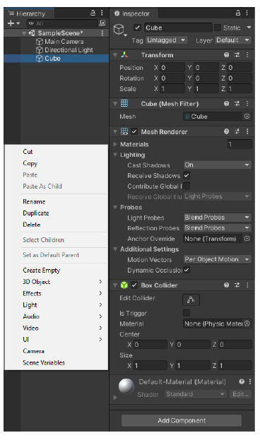 

 

# 5  

On peut programmer ses propres composants grâces aux scripting : une fois associés à un objet, ils apparaissent sous la même forme que les autres composants (voir scripts)  

**Propriétés spatiales : Transform**  

Il existe un composant qui est présent sur tout objet (même vide) : Transform.
Le Transform stocke la position, l’orientation et l’échelle de l’objet sur lequei il est placé sous forme de vecteur selon un axe XYZ (représenté par des flèches de couleur RGB).
Astuce : Ces propriétés peuvent être modifiées :  

- En édition via l’outil ou directement via l’inspector.
- En exécution via scripting avec les méthodes appropriées. 

 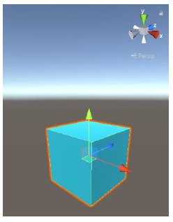  

**Propriétés spatiales : Graphe de scène**  

Le graphe de scène permet une organisation des différents objets de la scène dans une hiérarchie.  

- Chaque objet n’a qu’un seul parent mais peut avoir plusieurs enfants.
- Toute opération spatiale effectuée sur un objet est répercutée sur ses enfants.
- L’objet en haut de la hiérarchie est la racine (root)  

Comme dans tout espace 3D, il existe ce que l’on appelle un repère, qui permet d’identifier l’emplacement (les coordonnées) d’un objet dans l’espace. Il existe deux repères :  Coordonnées Locales définie par rapport à son parent  Coordonnées Globales définie par rapport à l’origine de la scène  

**Astuce** :  
 Le transform d’un objet dans l’inspector est forcément local. On peut cependant accéder aux coordonnées globales et locales via script. 

 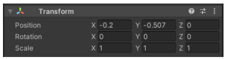  

# 6    

**NB** :  
 Pour que votre programme n’ait pas de comportement imprévu, il est recommandé de toujours manipuler des modèles à une échelle uniforme (1, 1, 1). Pour cela il faut donc créer les modèles à la taille voulu dans un logiciel de modélisation 3D.  

1 unité Unity = 1 mètre (100cm).

 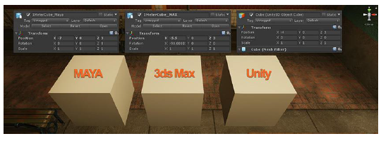  

**Propriétés géométriques et visuelles**  

Vous avez appris pour qu’un objet « existe », il faut que cet objet ait un maillage et sois rendu par la carte graphique. C’est ce à quoi servent respectivement les composants Mesh Filter & Mesh Renderer.  

 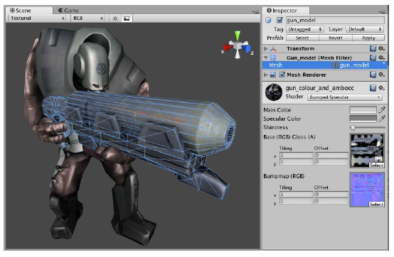 

**Textures**  

Une texture est une image représentant une surface offrant la possibilité de simuler l’apparence de celle-ci lorsqu’elle est plaquée sur un objet 3D.  

Il existe plusieurs types de texture pour simuler différent effet :  

# 7    

**a. Albedo (ou Diffuse)**  

L’Albedo est le type de texture le plus courant. Il définit la couleur et le motif de l'objet.  

**Astuce** : Elle ne contient aucune information de lumière.  

 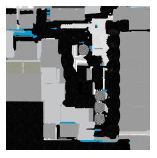

**b. Normal Map**  

La Normal Map est une technique utilisée pour ajouter des détails à une surface sans augmenter le nombre de polygones. Elle peut représenter les détails de surface comme les rides, les rayures et les bords biseautés. 

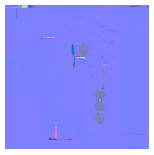
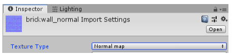

**Astuce** : Ne pas oublier, dans les paramètres de la texture de Normal Map de la passer en Texture Type > Normal Map.  

**c. Metallic**  

La Metallic Indique au shader si l’objet est en métal ou non. Il peut y avoir des valeurs de gris de transition, cela permet de simuler de façon satisfaisante des imperfections, ou la présence d'un dépôt de matière non métallique comme la poussière, sur la surface des métaux, sans requérir à une meilleure résolution de texture.  
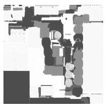

**Astuce** : Métal brut = 1.0 (Blanc) et non métallique = 0.0 (Noir) / On la retrouve parfois de couleur rouge. En effet, car une texture est composée de plusieurs canaux (RGBA) et la metallic utilise le canal Rouge (R).  

**d. Ambient Occlusion**

L’Ambient Occlusion indique comment les différents points de la surface sont exposés à la lumière du milieu environnant. Elle permet d'assombrir les zones naturellement difficiles d'accès à la lumière. Cela a pour effet de faire ressortir les détails et la profondeur de la surface des objets.  

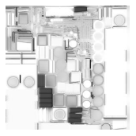

**e. Emissive**  

L’Emissive ne reçoit pas d’éclairage, de sorte que les pixels sont affichés à pleine intensité. Elle peut être utilisée pour ajouter un effet de lueur, comme des runes  

# 8    

magiques sur une épée, le matériau chauffé sur une torche ou une LED de veille sur une TV.  

**f. Specular**  

La Specular contrôle la quantité de lumière qui rebondit / est réfléchie par la surface d’un objet.  

**g. Roughness**  

La Roughness décrit la dispersion des rayons lumineux sur la surface d’un objet. Plus la surface est rugueuse, plus le reflet sera sombre et large. On peut l’apparenter à un reflet flous.  

**Astuce** : Rugueux = 1.0 (Blanc) et Lisse = 0.0 (Noir) / Pour le shader ”Standard” de Unity elle se situe dans la couche (A) Alpha de la Metallic Map.
Ces textures peuvent avoir différentes définitions :  

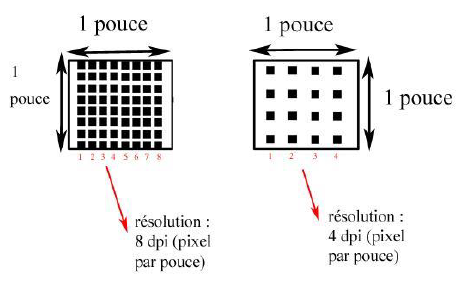

a. 256 * 256 pixels  

b. 512 * 512 pixels  

c. 1024 * 1024 pixels (1k)  

d. 2048 * 2048 pixels (2k)  

e. 4096 * 4096 pixels (4k)  

et peuvent avoir différentes résolutions :  

a. 72 dpi  

b. 150 dpi  

**Astuce** :  
 En France, nous avons souvent tendance à faire un abus de langage à propos de la “Définition” que nous appelons “Résolution”. Attention, dans le jeu vidéo à ne pas confondre les deux.  

On parle souvent également de textures dites “Tileable” ou de temps en temps vous pourrez croiser ce terme “Seamless”, en des termes simples, une texture tileable est une image qui peut être placée à côté d'elle-même (au-dessus, au-dessous ou côte à côte) sans créer une disparité, une jonction ou une limite évidente entre les copies de l'image.  

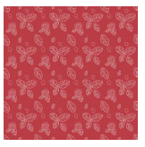

# 9    

**Materials (PBR)**  

Lorsque l’on parle de Texture, nous devons forcément parler des Matériaux. Ces matériaux prennent en paramètres une ou plusieurs textures pour définir les paramètres de surface de l’objet.  

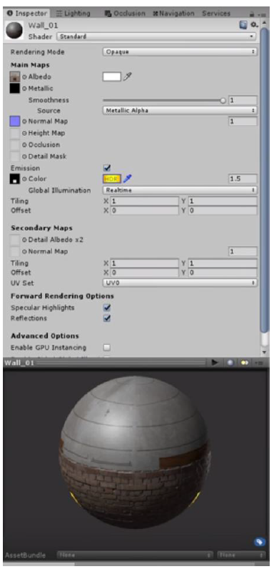

**Anecdote** :  
 Jusqu’ici, dans les jeux vidéo, la lumière était gérée par chaque artiste pour chaque objet indépendamment les un des autres. On pouvait se retrouver avec des objets qui n’étaient pas illuminés de la même façon alors qu’ils étaient positionnés côte à côte. Il fallait donc traiter isolément chaque objet pour l’adapter à son environnement.  

Avec l’arrivé des matériaux PBR (Physically Based Rendering), nous avons pu avoir un rendu photoréaliste.  

**Astuce** :  
 Ne pas oublier qu’un Materials est appliqué à un objet, et que plusieurs textures peuvent être appliquées à un Materials.  

**Astuce** :  
 Pour créer un Materials, Clique droit Vue Projet > Create > Material

**Shader**  

Nous parlons de Matériaux, de Textures et de Shaders, mais que sont-ils ?
Les shaders sont tout simplement des logiciels (du code) qui permettent de paramétrer le type de rendu souhaité.  

**Astuce** :  
 Avec un même matériel, nous pouvons par exemple afficher une feuille d’arbre sur un plan d’un seul côté ou des deux en changeant simplement le shader utilisé (Double Sided).  

# 10    

**Camera**  

La Camera est toujours présente par défaut lorsque vous démarrez un nouveau projet sous le nom de “Main Camera”.  

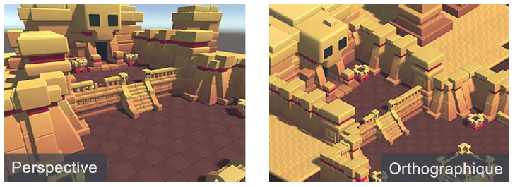

Voici les principales propriétés à retenir de la Camera : Clear Flags Comment la caméra efface l'arrière-plan ou ce qu’affiche la caméra. Background La couleur affichée s’il n’y a pas de Skybox. Culling Mask Genre de Layer qui permet d’afficher les éléments que l’on souhaite.  
 Projection Définit si la caméra doit rendre en mode Orthographique ou Isométrique. Field Of View (FOV) Le champ de vision de la caméra en degrés. Clipping Planes Définit le plan d’écrêtage. (Où commence et où finit l’affichage)  

# 11    

Depth Profondeur de la caméra dans l’ordre de rendu de la caméra Target Texture Destination du rendu de la texture. Target Display Règle l’affichage cible de la caméra.  

La caméra est l’un des éléments les plus important dans une application ou un jeu vidéo, elle détermine le point de vue à adopter.  

On peut citer différents exemples selon son placement et ses paramètres :  

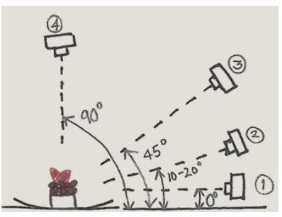

a. son type : première personne, troisième personne, ... ou encore une caméra 2d (deux dimensions) ou 3d (trois dimensions)  

b. son placement par rapport au personnage :  

● Centrée sur le personnage avec une vue sombre et limitée pour un jeu d’horreur,  

● Toujours centrée sur le personnage mais avec une vue plus éloignée et une vision nette de l’environnement  

pour l’exploration  

● Une caméra qui anticipe la direction du personnage en étant encore plus éloignée pour que le joueur puisse anticiper l’environnement et les obstacles suivants  

c. Le placement changera l’immersion et le dynamisme du jeu, ce qui peut provoquer l’intuitivité de l’action.  

d. Le plan : fixe (le personnage bouge, mais pas la caméra) ou dynamique (la caméra suit le personnage dans ses mouvements). 

 **Astuce** : Vous pouvez ajouter une Skybox à une scène simplement en configurant la propriété dans la fenêtre Éclairage (Lighting) Window > Lighting  

# 12    

**Astuce** :  
 Il est apparu dans les dernières versions de Unity un nouveau Système d’animation de Camera le “Cinemachine”, avec beaucoup de paramètre en plus que je ne détaillerais pas ici. Vous le trouverez dans Window > Packet Manager > Cinemachine. Il apparaîtra dans un nouvel onglet dans Unity qui vous permettra de l’utiliser.  

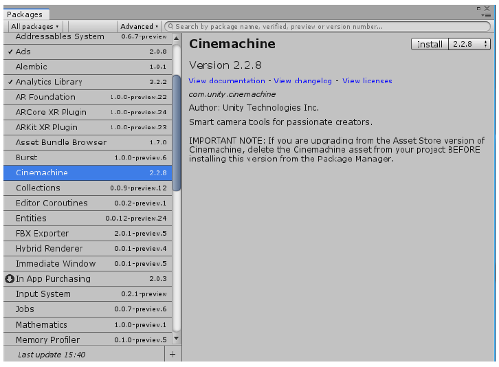

**Global Illumination**  

Pour bien comprendre la “Global Illumination” et donc la gestion de la lumière, il faut tout d’abord savoir comment la lumière réagit et connaître la différence entre “Indirect Lighting & Direct Lighting”.  

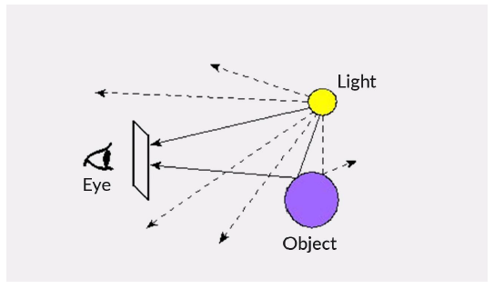

# 13    

Dans la vie IRL, la lumière peut subir plusieurs phénomènes (voir image ci-dessous). Elle rencontre également différents éléments sur sa route sur lesquels elle rebondit. L’oeil humain capte ces phénomènes.  

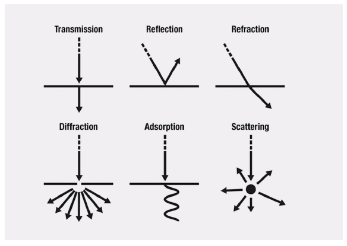

# 14    

**a. Direct Lighting**  

La “Direct Illumination” permet à un rayon de lumière de n’avoir qu’un seul rebond. Les objets ne seront pas illuminés de façon naturelle.  

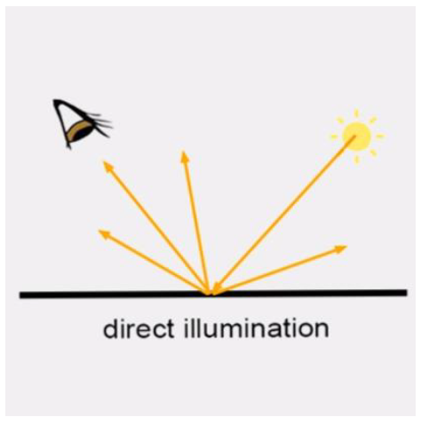

**b. Indirect Lighting**  

La “Indirect Lighting” permet aux rayons de lumière de pouvoir avoir autant de rebond que l’on souhaite (les nombres de rebonds max est à paramétrer dans le Light Settings). L’effet donné sera au contraire beaucoup plus naturel.  

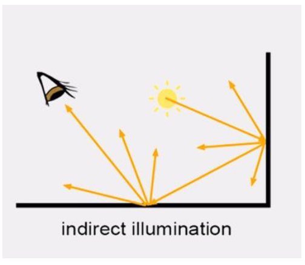

# 15    

**Lights**  
 Nous avons vu plus haut la Global Illumination qui n’est rien d’autre que l’application du “Direct & Indirect Illumination”. En utilisant donc cette méthode nous allons voir l’utilisation de la lumière.  

Il existe deux façons de créer de la lumière (lumière ambiante et matériaux émissifs), selon la méthode d'éclairage que vous avez choisie.  
**Astuce** : Les lights peuvent être ajoutées via un Clique droit > Light.  

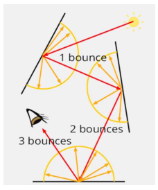

a. La Point Light Une Point Light est situé à un point dans l'espace et envoie de la lumière dans toutes les directions de manière égale. La direction de la lumière heurtant une surface est la ligne du point de contact vers le centre de l'objet lumineux. L'intensité diminue avec la distance de la lumière, atteignant zéro à une portée spécifiée. L'intensité de la lumière est inversement proportionnelle au carré de la distance de la source. C'est ce qu'on appelle la «loi carrée inverse» et est semblable à la façon dont la lumière se comporte dans le monde réel.  
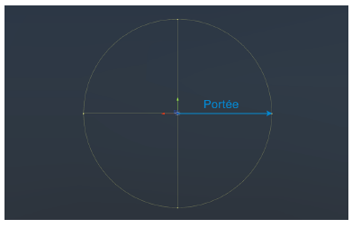

**Astuce** :  
 Les Point Lights sont utiles pour simuler des lampes et d'autres sources locales de lumière dans une scène. Vous pouvez également les utiliser pour faire une étincelle ou une explosion pour éclairer son environnement de manière convaincante.  

# 16    

b. La Spot Light Comme précédemment, une Spot Light a un emplacement et une portée spécifiées sur lesquels la lumière tombe. Cependant, le spot est contraint à un angle, ce qui entraîne une zone d'illumination en forme de cône. Le centre du cône pointe dans la direction avant (z) de l'objet lumineux. La lumière diminue également au bord du cône du spot. L'élargissement de l'angle augmente la largeur du cône ainsi que la taille du fondu, connu sous le nom de «penumbra» (pénombre). Astuce : Les spots sont généralement utilisés pour des sources lumineuses artificielles telles que les lampes de poche, les phares de voitures ou de projecteurs.  

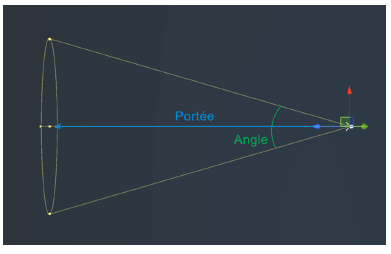

c. La Directional Light Les Directional Light sont très utiles pour créer des effets tels que la lumière du soleil dans vos scènes. Une lumière directionnelle n'a pas de position de source identifiable et donc l'objet lumineux peut être placé n'importe où dans la scène. Tous les objets de la scène sont éclairés comme si la lumière est toujours dans la même direction. La distance de la lumière de l'objet cible n'est pas définie et donc la lumière ne diminue pas.  

**Astuce** : Par défaut, chaque nouvelle scène d'Unity contient une Directional Light  

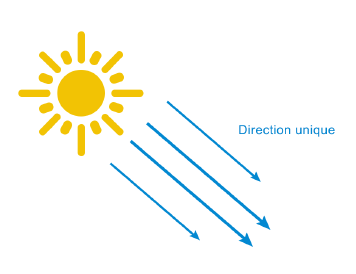

# 17    

d. L’Area Light Une Area Light est définie par un rectangle dans l'espace. La lumière est émise dans toutes les directions uniformément sur leur surface, mais seulement d'un côté du rectangle. Comme le calcul de l'éclairage nécessite beaucoup du processeur, les Area Light ne sont pas disponibles au moment de l'exécution et peuvent seulement être baked dans la lightmaps.   

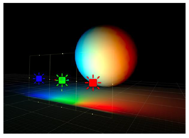

**Astuce** :  
 Étant donné qu'une lumière de zone illumine un objet à partir de plusieurs directions différentes à la fois, l'ombrage tend à être plus doux et subtil que les autres types de lumière. Vous pouvez l'utiliser pour créer une lumière de rue réaliste ou une banque d'éclairage proche du joueur. Une lumière de petite surface peut simuler de plus petites sources de lumière (comme l'éclairage intérieur d'une maison) mais avec un effet plus réaliste qu'un point de lumière.  

e. L’Emissive Material Comme l’Aera Light, les matériaux émissifs émettent de la lumière sur leur surface. Ils contribuent à la lumière “rebondit” dans votre scène et les propriétés associées telles que la couleur et l'intensité peuvent être changées pendant le jeu.  

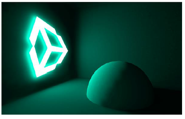

**Astuce** :  
 Par défaut, la valeur d’Emission est définie sur zéro. Cela signifie qu'aucune lumière ne sera émise par l’objet. L'émission ne sera reçue que par des objets marqués comme Static ou Lightmap Static dans l'inspecteur.  

# 18    

**Prefabs**  

Les Prefabs sont des sortes de templates, des patrons d’objets qui peuvent être réutilisés pour créer d’autres objets similaires. Si nous modifions le prefab source, les instances de celle-ci seront également modifiées. Astuce : On obtient un prefab à partir d’un modèle que l’on créé puis que l’on fait glisser de la fenêtre hiérarchie vers la fenêtre projet. On peut par la suite créer autant d’instance que l’on veut à partir de ce prefab. 

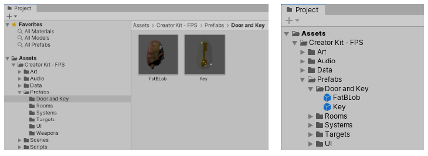

**La Physique (Collider / Rigidbody)**  

Dans Unity nous pouvons appliquer de la physique à nos objets par le biais de plusieurs Component.  

a. Rigidbody Les Rigidbodies permettent à votre GameObject d'agir sous le contrôle de la physique. Le Rigidbody peut recevoir des forces et une torsion pour faire bouger vos objets de façon réaliste. Tout GameObject doit contenir un Rigidbody pour être influencé par la gravité, agir sous des forces supplémentaires via des scripts. Vous pouvez ajouter un Rigidbody à votre objet sélectionné dans le menu Components > Physics > Rigidbody.  

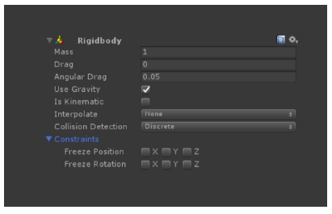

# 19  

**Propriétés :**  

**Mass**  

La masse de l’objet (unité arbitraire). Il est recommandé de ne pas dépasser une différence de 100 unités entre les masses de vos différents rigidbodies  

**Drag**  

La résistance de l’air qui affecte le rigidbody lors de son déplacement par l’ajout de forces. La valeur « 0 » signifie aucune résistance et infiniy arrête le déplacement de l’objet immédiatement (Coefficient de frottement)  

**Angular Drag**  

La résistance de l’air qui affecte le rigidbody lorsqu’il tourne par l’ajout de torsion (torque). La valeur « 0 » signifie aucune résistance et infiniy arrête la rotation de l’objet immédiatement  

**Use Gravity**  

Soumis / affecté par la gravité  

**Use Kinematic**  

Si cette propriété est activée, l’objet ne sera pas contrôlé par l’engin physique et pourra être manipulé à l’aide de sa propriété Transform. Peut être utilisé pour animer des plates-formes par exemple (Cinématique)  

**Interpolate**  

La transformation (calcul physique) est lissée en rapport avec la frame suivante ou précédente.  

**Collision Detection**  

Type de détection de collision, utilisé pour empêcher les objets en mouvement rapide de passer à travers d’autres objets sans détecter de collisions  

**Constraints**  

Restreins les rigibodies dans leur mouvement.  

b. Collider Les composants Collider définissent la forme, le volume d'un objet pour permettre la détection des collisions physiques. Un collider, invisible, n'a pas besoin d'avoir exactement la même forme que le maillage de l'objet, une approximation est souvent plus efficace et  

# 20  

indiscernable dans le gameplay. Les colliders les plus simples (et les moins gourmands pour le processeur) sont les types dits de collision primitive.  
En 3D, ce sont les Box Collider, Sphere Collider et les Capsule Collider. N'importe quel nombre de ceux-ci peuvent être ajoutés à un seul objet pour créer des collisions composées. Il existe cependant quelques cas où les collisions primitives ne seront pas suffisamment précises. Pour cela, vous pouvez utiliser des Mesh Colliders pour correspondre parfaitement au maillage (mesh) de l’objet. Attention cependant, ces colliders sont beaucoup plus gourmand en ressource.  

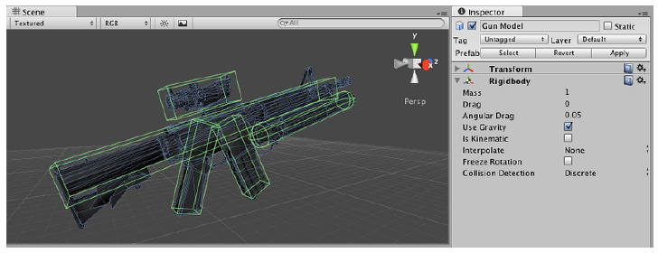

c. Le cas particulier des isTrigger Vous pouvez également utiliser le moteur physique pour détecter simplement quand un objet (donc son collider) pénètre dans un espace sans créer de collision. Un objet avec un collider configuré en tant que déclencheur (trigger) (utilisant la propriété IsTrigger) ne se comportera pas comme un objet solide et permettra simplement à d'autres objets / colliders de passer à travers lui. Lorsqu'un autre objet entre dans son espace, un déclencheur appellera la fonction OnTriggerEnter sur les scripts de l'objet déclencheur.  

# 21  

**Animations / Animator**  
 Les clips d'animation sont l'un des éléments principaux du système d'animation. Unity prend en charge l'importation d'animation à partir de sources externes et offre la possibilité de créer des clips d'animation à partir de zéro dans l'éditeur en utilisant la fenêtre Animation. Astuce : La fenêtre d’animation s’ouvre en allant dans Window.> Animation > Animation / Animator.  

c. Animations Importées Les clips d'animation importés à partir de sources externes peuvent inclure : ● Animations humanoïdes capturées dans un studio de capture de mouvement. ● Animations créées à partir de zéro par un artiste dans une application 3D externe (Tel que 3DS Max ou Maya). ● Les jeux d'animation à partir de bibliothèques tierces (Exemple: depuis Unity’s asset store ou Mixamo). ● Plusieurs clips sont coupés et découpés à partir d'une seule chronologie importée.  

b. Animations Importées La fenêtre d'animation d'Unity vous permet également de créer et éditer des clips d'animation. Ces clips peuvent être regroupés dans un animator et animé :  

 ● La position, la rotation et l'échelle des GameObjects.  
 ● Les propriétés des composants tels que la couleur du matériau, l'intensité d’une lumière, le volume d’un son  
● Les propriétés dans vos propres scripts, y compris float, int, Vector et variables booléennes.  

# 22  

**Astuce** :  
 Les animations peuvent être regroupées dans un component appelé “Animator”. Celui ci est appliqué à votre GameObject que vous souhaitez animer.

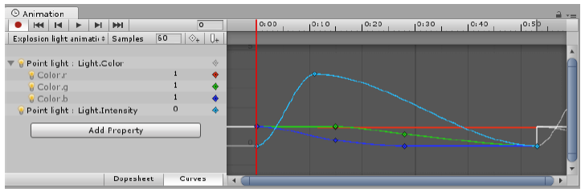

**Arborescence**  

L’arborescence de votre projet est très importante car elle va définir votre façon de travailler ainsi que celle de votre équipe.  

Vous trouverez plusieurs manières de construire votre projet.  

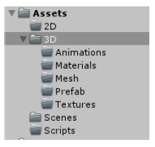

**Nomenclature**  

La nomenclature permet d’élaborer une structure afin de classer efficacement tous les éléments d’un même projet. Forme : (Prefix_)AssetName(_Number)(_Suffix)  

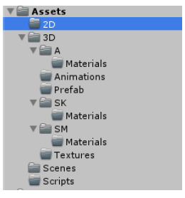

# 23  

**Exemple** : T_Rock_01_A  

Voici des règles simples et des idées pour vos convention de nommage :
- Bases
o Tous les noms sont en anglais
o Tous les assets doivent être dans des dossiers
- Dossiers
o Par Asset
- Asset/Gameplay
- Asset/Characters
- Asset/Sound
- Asset/UI
- Asset/Vehicles
- Asset/Weapons
- Asset/Environment
- Asset/Environment/Background
- Asset/Environment/Water
- Asset/Environment/Sky
- Asset/Environment/Props
- Asset/Environment/Buildings
o Par Catégorie
- Asset/Materials
- Asset/Textures
- Asset/Animations
- Asset/Particles
- Asset/Meshes (3D)
- Asset/Meshes/SK
- Asset/Meshes/SM
- Préfixes
o Par usage :
- CH_ : Characters
- UI_ : User Interface
- VH_ : Vehicles
- WP_ : Weapons
o Par Type  

# 24  

- SK_ : Skeletal Mesh
- SM_ : Static Mesh
- S_ : Sound
- M_ : Materiel
- T_ : Texture
- SP_ : Sprite
- PM_ : Physical Material
- Suffixes
o Textures :
- _A : Albedo
- _N : Normal Map
- _M : Metallic
- _AO : Ambient Occlusion
- _S : Specular
- _R : Roughness
- _H : Height Map
o Par Type
- SK_ : Skeletal Mesh
- SM_ : Static Mesh
- S_ : Sound
- M_ : Materiel
- T_ : Texture
- SP_ : Sprite
- PM_ : Physical Material  

Voici un exemple :  

# 25  

**Astuce** :   
Gardez à l'esprit qu’il est important de garder la même nomenclature tout au long de vos projets.  
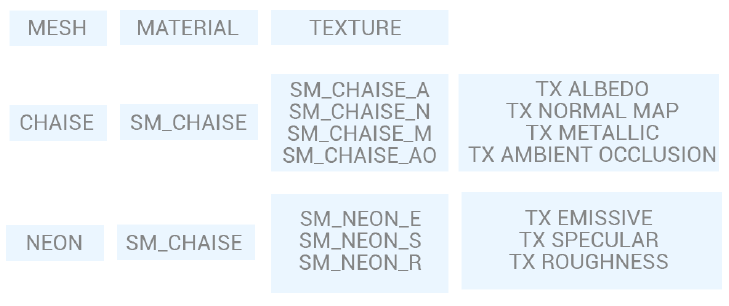

**Optimisation**  

La performance d’un jeu ou d’une application peut faire ou défaire l’expérience utilisateur. Pour cela, un jeu doit être correctement optimisé, fluide et réactif. Bien que chaque jeu ou application puisse nécessiter d’une approche différente, voici les techniques clés que vous pouvez utiliser dans la plupart des situations.  

**a. Profiler**  

Avant de commencer à supprimer des lignes de code, à affiner les prefabs et à essayer de tout rendre performant, vous devez savoir ce qui cause réellement des problèmes de performances. Le Profiler est un excellent moyen d'avoir un aperçu détaillé de la performance de votre jeu. Vous pouvez trouver le Profiler sous Window > Analysis > Profiler et il fonctionnera quand vous jouerez votre partie.  

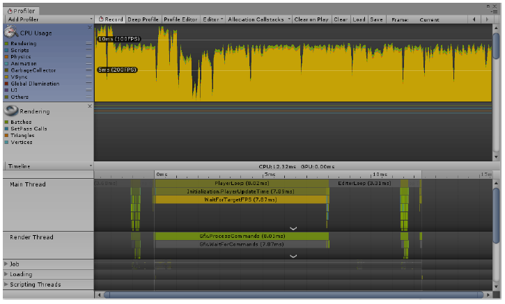
**b. Static Object**  

# 26  

Cela signifie que l'objet ne bougera pas, ne s'agrandira pas ou ne tournera pas. Dans la mesure du possible, si l’objet n'a pas besoin de se déplacer pour une raison quelconque, cochez la case statique en haut à droite de l'inspecteur. Vous utiliserez généralement ce paramètre en parallèle du Light Baking. 

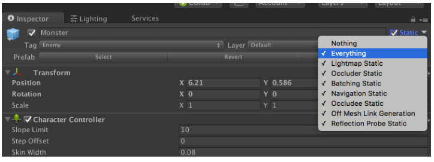

**c. Light Baking**  

 L'éclairage peut être un sujet assez complexe, mais en général, vous devez utiliser le minimum de lumières nécessaires pour obtenir le style désiré. Les lumières peuvent être l'un des aspects les plus coûteux d'un jeu. Dans Unity, il y a trois modes de lumière: Realtime, Mixed et Baked. ● Le Realtime est le meilleur, mais il a un coût de performance. Cela permet également des ombres dynamiques, qui sont également coûteuses à utiliser. ● Le Baked peut et doit être utilisé autant que possible. Cela vous permet d'ajouter de l'éclairage à votre monde tout en vous donnant les avantages de performance de ne pas avoir à calculer la lumière dynamique à tout moment. Gardez à l'esprit que vous pouvez "fausser" l'éclairage en utilisant des cartes émissives, qui font apparaître des parties de la texture pour émettre de la lumière.  
 
  Un exemple serait le tableau de bord d'un avion qui a beaucoup de petites lumières. Créer une lumière ponctuelle pour chacune d'entre elles serait  

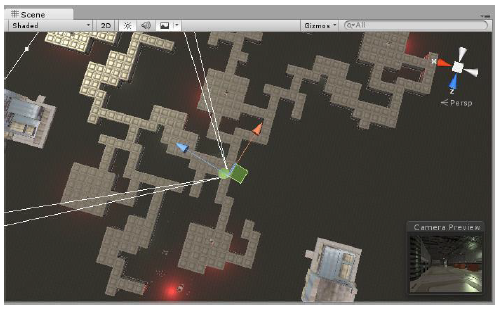

# 27  

incroyablement coûteux, mais l'utilisation d'une série de zones émissives sur une grande carte de texture sert non seulement le même but, mais est également beaucoup plus performante. (voir chapitre Emissive)  

**d. Light Probe**  
 Les Light Probes est un réseau de petites sphères jaunes qui vont enregistrer les informations de couleur d’une lumière à un endroit précis. Lorsqu’un objet dynamique passe proche d’une sphère (prob), il recevra en plus cette information d’éclairage. Astuce : Clic droit.> Light > Light Probe Group.  

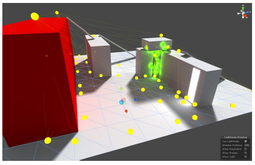 

**e. Reflection**  
 Probe Les Reflection Probes sont des sondes qui vont permettre d’enregistrer la réflection sur 360°, un peu comme une caméra qui capture une vue sphérique de son environnement dans toutes les directions. Astuce : Clic droit.> Light > Reflection Probe.  

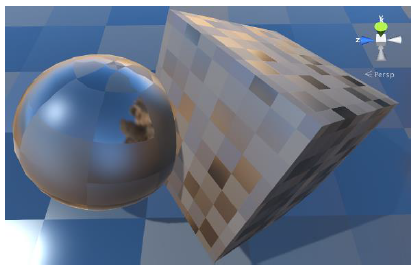 

**f. Occlusion Culling**  

# 28 

L’Occlusion Culling consiste à ne pas permettre le rendu de ce que ne voit pas la caméra. Cela nous permet de gagner beaucoup en performance. Pour l’activer, il faut se rendre dans Window > Rendering > Occlusion Culling  

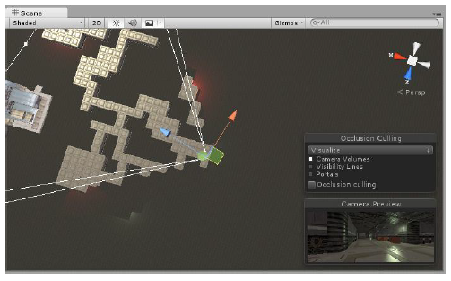 

**g. LOD (Level Of Detail)**  

 Dans de nombreux jeux, un moyen rapide et efficace de rendre des objets sans compromettre l'expérience du joueur serait de ne rendre que des versions Low Poly des meshes présents dans notre scène et d'éliminer les petits objets de manière plus agressive que les grands. Par exemple, de petites roches et des débris pourraient être rendus invisibles à de longues distances, alors que les grands bâtiments seraient encore visibles.
C’est ce que permet le système Level Of Detail (LOD).
Pour ajouter un LOD sur un objet, dans l’inspector Add Component > LOD Group  

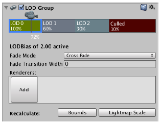

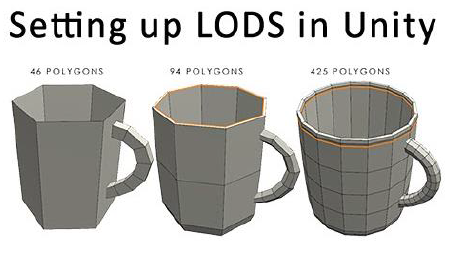

**h. Mip Mapping**  

# 29  

Le MIP mapping est une technique d'application de textures, les MIP maps, qui permet d'améliorer la qualité de l'affichage. Le but du MIP mapping est d'éviter la pixellisation lorsqu'on s'éloigne d'une texture. Ainsi un objet proche, affichera des textures en haute résolution, alors qu’un objet éloigné se verra attribuer une texture en basse résolution. Le Mip Mapping s’apparente au LOD pour les textures. Elle se gère directement dans l’Inspector de la texture sélectionnée.  

**Vuforia**  

Vuforia est une solution (une SDK) Cross-Platform destinée à la Réalité Augmentée (AR).
Il vous faudra tout d’abord créer un compte développeur sur le site officiel : https://developer.vuforia.com/  

Y créer une Base de donnée et y uploader les images qui vous permettront de générer ce que vous voulez en AR.  

Importer la base de donnée et la clé de l’API de vuforia sur Unity.
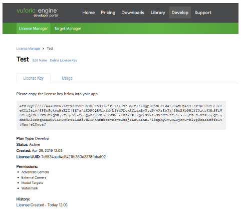 
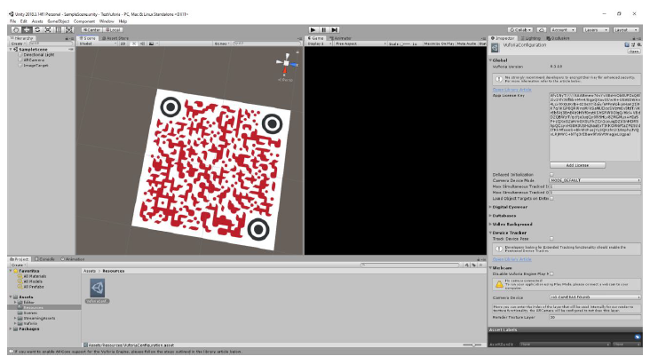  

# 30  

Voici les étapes pour une application simple via Vuforia :  

- Activer Vuforia dans les Player Settings > XR Settings
- Ajouter votre clé API dans Window > Vuforia Configuration
- Supprimer la Main Camera et y ajouter un ARCamera via Create > Vuforia Engine > AR Camera
- Ajouter une ImageTarget via Create > Vuforia Engine > Image
- Choisir l’image Target
- Mettre en enfant de l’image, l’objet que vous voulez voir apparaître lorsque la caméra scannera l’image  

**Sauvegarde & partage**  

Unity permet de partager des « Package », des fichiers de votre projet. On fait, ce que l’on appelle, un export de Package vers un .On peut choisir différents éléments du projet à exporter vers un autre dans un .unitypackage.  

Un certain nombre de packages de base sont importables, attention cependant à vérifier que le package généré contient tout le nécessaire à son fonctionnement. Pour ce faire, rendez-vous dans Assets > Export Package.  

# 31  

**Astuce** :  
 Supprimer du projet tous les assets inutiles, pour éviter de prendre la place inutilement.
Build de l’application  

Le build signifie construire en français, c’est la génération de l’application finale. En effet, Unity est un moteur de jeu multiplateforme, il peut générer une application pour différentes plateformes.  

Pour cela veuillez-vous rendre dans File > Build Settings , sélectionnez les scènes à insérer dans l’application ainsi que la plateforme choisie. Astuce : Certaines plateformes, tels que iOS ou PS5 nécessitent des plugins supplémentaires qui peuvent être parfois payants.

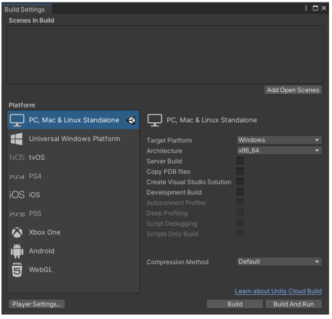  